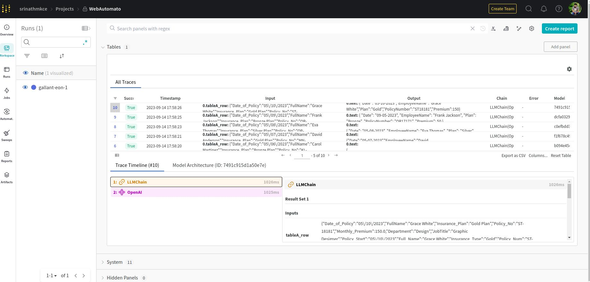

This example uses OpenAI - GPT4 to map information from multiple tables to a target template by following templates and transformations.

Install langchain and wandb

```
pip install langchain wandb
```
Export the openai api key
```
export OPENAI_API_KEY=<YOUR-OPENAI-API-KEY>
```
Login into wandb and paste the api key
```
wandb login
```

Run the following command to map the tables
```
python convert_table.py --source 'table_A.csv,table_B.csv' --template 'template.csv' --target 'output.csv'
```
Sample output

```
wandb: Streaming LangChain activity to W&B at https://wandb.ai/srinathmkce/WebAutomato/runs/2bomkkx3
wandb: `WandbTracer` is currently in beta.
wandb: Please report any issues to https://github.com/wandb/wandb/issues with the tag `langchain`.
         Date    EmployeeName    Plan PolicyNumber  Premium
0  05-01-2023        John Doe    Gold      AB12345      150
1  05-02-2023      Jane Smith  Silver      CD67890      100
2  05-03-2023   Michael Brown  Bronze      EF10111       50
3  05-04-2023   Alice Johnson    Gold      GH12121      150
4  05-05-2023      Bob Wilson  Silver      IJ13131      100
5  05-06-2023  Carol Martinez  Bronze      KL14141       50
6  05-07-2023  David Anderson    Gold      MN15151      150
7  05-08-2023      Eva Thomas  Silver      OP16161      100
8  09-05-2023   Frank Jackson  Bronze      QR17171       50
9  05-10-2023     Grace White    Gold      ST18181      150

```

The openai output can be tracked and compared in wandb as well



